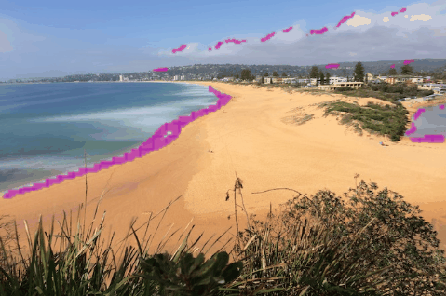
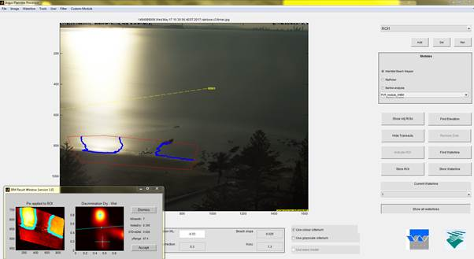
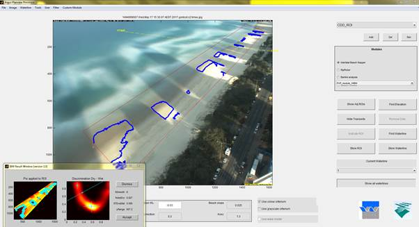

# CNN Shoreline detection model
Shoreline detection using a modified Hollistic Edge Detection (HED) Convolutional Neural Network (CNN) approach. The algorithm identifies from images the pixels most likely to represent the shoreline, at the intersection between the water and sand.

*Written by Joshua Simmons using PyTorch.*

*Note: while this model shows promise, it is still under development to improve performance. As can be seen below, while it shows excellent performance in some images, it is not currently robust enough for use in production. The `Shoreline_detection_predict_unseen.ipynb` notebook can be run on provided images as an example.*

*Figure 1 - Identified shoreline 'edges' overlaid in magenta*

## 1. Problem
Shoreline detection methods are well established in the field of coastal imaging and seek to divide wet from dry pixels ([Harley et al., 2019](https://doi.org/10.1016/j.coastaleng.2019.04.003)). Existing methods have tended used pixel hue and intensity ([Plant and Holman, 1997](https://doi.org/10.1016/S0025-3227(97)00019-4); [Aarninkhof et al., 2003](https://doi.org/10.1016/S0378-3839(03)00064-4)), RGB colour channels (e.g., Turner et al., 2004; [Plant et al, 2007](https://doi.org/10.2112/1551-5036(2007)23[658:TPOSDM]2.0.CO;2)), and even machine learning techniques which seek to classify on a pixel-by-pixel basis ([Hoonhout et al, 2015](https://doi.org/10.1016/j.coastaleng.2015.07.010)). Many applications rely on the well validated threshold techniques based on the distribution of the RGB channels with excellent results (e.g., [Harley et al., 2019](https://doi.org/10.1016/j.coastaleng.2019.04.003))

However, when undertaking automated processing over years of image data, there are many situations that can present challenges to these types of algorithms. Figures 2 and 3 show this algorithm failing due to glare and shadow effects. Even small improvements in accuracy can save engineers large amounts of time when checking of shoreline data.

*Figure 2 - Failure of an RGB based shoreline detection algorithm due to glare*

*Figure 3 - Failure of an RGB based shoreline detection algorithm due to shadows*

## 2. Description
The CNN developed here is used to identify those pixels most likely to be shoreline pixels with the aim of identifying an accurate region of interest. Once this is obtained, established and validated shoreline detection algorithms can search within this narrow band to find the precise shoreline. This repository seeks to test the usefulness of such an approach.

This code adapts the HED CNN architecture developed by [Xie and Tu (2015)](http://openaccess.thecvf.com/content_iccv_2015/papers/Xie_Holistically-Nested_Edge_Detection_ICCV_2015_paper.pdf) and is adapted from a PyTorch implementation by [buntyke](https://github.com/buntyke/pytorch-hed).

### Training data
The CNN model provided was trained on images from six sites monitored as a part of the [Water Research Laboratory](http://www.wrl.unsw.edu.au) (UNSW Syney) [coastal imaging program](http://ci.wrl.unsw.edu.au). Training images used were time-averaged and oblique. Checked shorelines form an existing database were used to train the model and were provided as vectors of U (width), V (height) pixel coordinates.

The file `./functions/data_preprocessing.py` provides functions which load the images (X data) and shorelines (Y data), pre-process them to reduce the size to a manageable 320x480 and augment them if required.

`Shoreline_detection_create_data.ipynb` notebook was used to create the data for training.

### Training
A weighted binary cross-entropy loss was used as the ratio of shoreline pixels to image size was small. A regularised implementation of this loss is also available which penalises the total number of pixels selected in an attempt to sharpen the edge detected.

`Shoreline_detection_create_data.ipynb` notebook was used to undertake model training.

## 3. Usage
A demonstration of the use of the trained shoreline detection network can be run using the example notebook `Shoreline_detection_predict_unseen.ipynb`. The CNN is used to predict the shoreline across a range of unseen images images. Some images are taken from the Narrabeen coastal imaging station (one of the beaches used to train the model). Other images are from different beaches provided by [coastsnap](https://www.facebook.com/coastsnap/) and include both time-averaged and still images at multiple sites.

## 4. Environment
Anaconda environment with package requirements provided as `environment.yml`. Tensorflow should be done separately depending on your GPU configuration.

## 5. Planned improvements
- Improved training:
    - Training could be improved with more images (current training was limited by available GPU)
    - Checkpoint models need to be examined to check training is progressing as intended and the model solution is not getting stuck.
    - Broaden the band around the training data shoreline so that the algorithm has an easier time converging on a good solution.
- Post-processing:
    - The model output can be easily post-processed to remove small misclassified pixels.
    - This could be done with an adaptive thresholding and openCV blob tools (as we know we are looking for long continous and smooth shoreline edges)

## Issues
This software is provided "as is", without warranty of any kind. If you encounter a problem/bug or have a question or suggestion, please use the "issues" tab on github. Otherwise, this software is unsupported.
